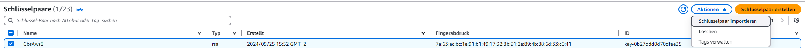
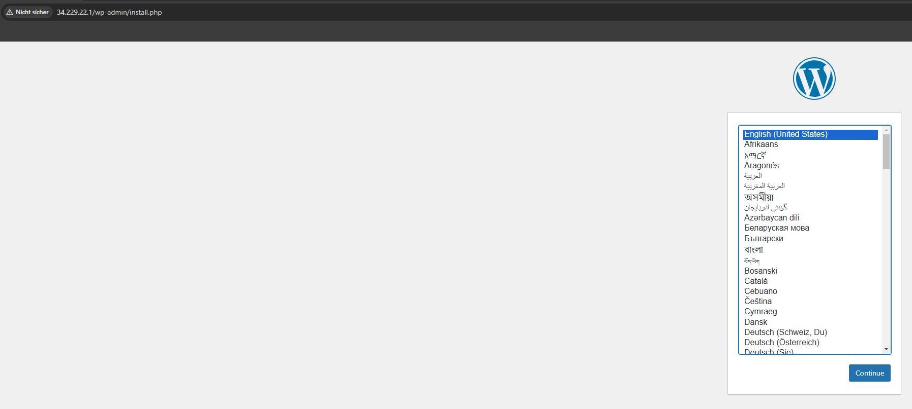

# *1. Projektanforderungen*

## **1.1 Ausgangslage**  
Im Rahmen des Moduls M346 hatten wir die Aufgabe, ein Content Management System (CMS) unserer Wahl oder ein Ticket System auf der AWS-Cloud aufzusetzen. Ziel war es, eine automatisierte Infrastruktur bereitzustellen, bestehend aus einem Webserver und einer Datenbank. Das Projekt ermöglichte es uns, unsere Kenntnisse im Bereich **Automatisierung** und **Infrastructure as Code (IaC)** praktisch anzuwenden und zu erweitern. Wir haben uns für das CMS beschrieben, da ich es spannend finde, zu sehen, wie man eine Webseite aufsetzt und diese dann gestaltet. Ein Arbeitskollege aus meiner Firma hat nämlich auch eine Webseite über seine ganzen Berufsinformationen und Lebenslauf, welche er bei Bewerbungen mitsendet. Das fand ich sehr spannend und wollte mir das auch ansehen. Das war der Grund, weshalb wir das Projekt CMS verwendet haben, mit dem Service WordPress.

---

## **1.2 Zielsetzung**  
- **Automatisierte Bereitstellung** der AWS-Infrastruktur mit EC2-Instanzen.  
- **Installation und Konfiguration** eines CMS (WordPress) auf einem Webserver.  
- **Einrichtung einer separaten Datenbankinstanz** zur sicheren Kommunikation mit dem CMS.  
- **Konfiguration von Sicherheitsregeln**, um den Zugriff von aussen zu ermöglichen.  
- **Dokumentation der Projektumsetzung**, inklusive Testfälle und Reflexion.

---

## **1.3 Aufgabenverteilung**  
- **Tom:** Erstellung der Skripts für die automatisierte Aufsetzung via. Cloudshell und SSH
- **Kilian:** Problemunterstützung und kleine Skripts schreiben, wenn es zu Komplikationen bei der Erstellung der Skripts kommt und dann die Dokumenation führen.

- ---

# **2. Installation und Konfiguration**  
## **2.1 Voraussetzungen**
- AWS CLI muss installiert und konfiguriert sein.
- Ein gültiger SSH-Key zur Verbindung mit den Instanzen, welcher mit dem Skript ["iac.sh"](./iac.sh) erstellt werden kann.
- Git ist installiert oder Online Verfügbar. Vorteilhaft wäre aber lokal, damit man alle Skripts gerade zur Verfügung hat.
## **2.2 Automatisierung der Infrastruktur** 
Wir haben uns folgendes bei der Automatisierung überlegt. Zuerst ist und eingefallen, dass wir schonmal einen Webserver via. AWS eingerichtet haben, dieser aber einfach via. der Weboberfläche. Da habe ich mir nochmals das vorgehen angesehen und bin zu folgenden Erkentnissen gekommen. Zuerst muss der Key erstellt werden. Dann muss die AWS Instanz mit den Security Keys eingerichtet werden. Die AWS Instanz kann man mit jedem Betriebssystem machen, aber wir haben es damals mit Linux Ubuntu gemacht, was wir diesmal genau so machen werden, einfach vollautomatisiert mit Skripts. Auf der Instanz müsste dann via. SSH der Datenbankserver, Webserver und WordPress installiert werden. WordPress und den Datenbankserver haben wir noch nie auf Linux installiert, aber das sollte mit etwas recherche schon gehen.
## **2.3 Konfiguration des Webservers** 
Das Skript auf dem Datenbankserver installiert zunächst den MariaDB-Server, aktualisiert die Paketquellen und passt die Konfiguration an, sodass die Datenbank auf allen Netzwerkinterfaces erreichbar ist. Dann wird für den Root-User ein sicheres Passwort gesetzt. Anschliessend legt das Skript eine neue Datenbank für WordPress, einen dedizierten Datenbankbenutzer mit eigenem Passwort sowie die erforderlichen Berechtigungen an. Dadurch ist die Datenbank bereit, von einer externen Webserver-Instanz angesprochen zu werden.
## **2.4 Konfiguration der Datenbank**  
Auf dem Webserver-Host installiert das Skript Apache, PHP sowie notwendige PHP-Module. Danach wird der Webserver gestartet und aktiviert. Es lädt die neueste WordPress-Version herunter, entpackt sie direkt in das Apache-Dokumentenverzeichnis und passt die WordPress-Konfigurationsdatei an, indem Datenbankname, Benutzer, Passwort und die interne IP des Datenbankservers eingetragen werden. Abschliessend setzt das Skript korrekte Datei- und Verzeichnisrechte und startet Apache neu. Damit ist die WordPress-Seite unmittelbar über die öffentliche IP des Webservers erreichbar.

---

# **3. Anleitung zur Installation**  
Unter folgendem Link kann man AWS CLI auf den Client mit dem angegebenen Betriebssystem herunterladen: [AWS CLI Installation](https://docs.aws.amazon.com/cli/latest/userguide/getting-started-install.html#getting-started-install-instructions) und dann via. der Installationsdatei das ganze installieren. Auf Windows müsste man die Installierte MSI Datei ausführen und den Prozess der Installation kurz durchgehen und dann sollte das funktionieren.
## **3.1 Schritt-für-Schritt-Anleitung Instanzen**  
Das vorgehen der Installation wäre wie folgt. Zuerst führt man die Datei [iac.sh](./iac.sh) auf der Cloudshell in AWS aus und erstellt somit den Key, die zwei Instanzen und die Security Groups, damit die Verbindung auf die Instanzen via. HTTP, SSH und MySQL möglich ist. Sollte dieses Skript ohne Fehlermeldungen durchgeführt werden können, sind beide Instanzen mit Linux aufgesetzt worden. Wir haben dafür gesorgt, dass die Cloudshell auch gleich die öffentliche IP und den Key ausgibt, damit der Verbindung nichts im Weg steht. Ebenso sieht man für das spätere vorgehen, die IP, welche man im WordPress skript verwenden muss. Diese ist über dem Key und sollte schon mal rauskopiert werden und irgendwo abgelegt sein. Das sieht dort so aus, aber mit einer anderen IP: DB Private IP-Adresse (fuer WP-Setup verwenden): 172.31.21.112. Den Key muss man rauskopieren, ihn in eine Textdatei via. Notepad++ packen und als .PEM Datei speichern. Wichtig ist, dass der Key den gleichen Namen hat, wie der in der Cloudshell erstellte. Ein sehr passender Speicherort für den Key wäre unter Windows z.B. c:\users\user\\.SSH. Wenn der Key gespeichert wurde, kann man via. SSH auf die jeweilige VM verbinden. Folgender Code kann auf dem lokalen PC via. Powershell ausgeführt werden: ssh -i c:\users\user\\.SSH\Keyname.pem ubuntu@"Public IPv4".  Der Pfad muss je nach User angepasst werden. Z.B wäre es bei mir: c:\users\tom\\.SSH\Keyname.pem und dann je nach dem ein anderer Keyname. Die Public IPv4 Adresse sieht man in der Cloudshell und mann kann einfach diese verwenden und einfügen, z.B. ubuntu@3.67.34.109 und dann sollte die Verbindung möglich sein. Dies muss bei beiden VMs gemacht werden, damit man bei beiden, also DB und WP Konfigurationen vornehmen kann.

### **3.1.1 Schritt-für-Schritt-Anleitung DB** 
Nun haben wir 2 Powershell Seiten mit verschiedenen Instanzen offen. Wir beginnen zuerst mit der obigen IP, also dem Datenbankserver. Hier müssen wir wie folgt vorgehen. Wir erstellen auf der VM eine .sh Datei, damit wir das Skript nachher ausführen können und gehen wie folgt vor. Datei erstellen mit dem Code "touch configuration_db.sh" und dann den Inhalt via. "nano configuration_db.sh" bearbeiten und dann den Inhalt von [configuration_db.sh](configuration_db.sh) einfügen und speichern. Dann muss noch die Berechtigung der Datei via. "chmod +x configuration_db.sh" angepasst werden und sie kann dann via. "sudo ./configuration_db.sh" ausgeführt werden.
### **3.1.2 Schritt-für-Schritt-Anleitung WP**  
Nun kommt die untere IP, also der Webserver mit WordPress. Hier müssen wir wie folgt vorgehen. Wir erstellen auf der VM eine .sh Datei, damit wir das Skript nachher ausführen können und gehen wie folgt vor. Datei erstellen mit dem Code "touch configuration_wp.sh" und dann den Inhalt via. "nano configuration_wp.sh" bearbeiten und dann den Inhalt von [configuration_wp.sh](configuration_wp.sh) einfügen. Es muss noch der Punkt mit der IP des DB  Servers im Skript angepasst werden, was gleich hier gemacht werden kann. Dieser Teil ist mit einem Command markiert und dort muss die IP hinkommen, welche über dem .pem Key in der Cloudshell ausgegeben wurde. Diesen haben wir im Idealfall vorher beim erstellen der Instanzen schon rauskopiert, wenn das aber nicht der Fall ist, kann dieser gleich wie oben beschrieben noch geholt werden. Zum Schluss muss die Datei noch gespeichert werden. Dann muss noch die Berechtigung der Datei via. "chmod +x configuration_wp.sh" angepasst werden und sie kann dann via. "sudo ./configuration_wp.sh" ausgeführt werden.
## **3.2 Fehlersuche und Troubleshooting**  
Sollte es zu Fehlern während des ausführen kommen, könnte eines der Probleme zum Beispiel sein, dass es den Key schon gibt oder es eine Security Group mit dem gleichen Namen gibt. Das waren die Probleme die wir hatten, bei mehrfachem ausführen. Das sollte aber bei neuen Umgebungen kein Problem sein, da das Skript im Idealfall nur einmal ausgeführt wird. Eventuell könnte noch ein Fehler kommen mit der Fehlermeldung, dass es Probleme mit dem Backup gibt. Sollte dies der Fall sein, muss die neu erstellte Security Group nochmals gelöscht werden und dann das ganze erneut getestet werden. Dies hat bei unseren Testfällen bis jetzt immer funktioniert. Meinen Recherchen nach, könnte das Problem bei einer nicht ganz gestarteten AWS Umgebung liegen, aber verschiedene Quellen sagen unterschiedliches, deshalb ist dies nur eine Vermutung.

---

# **4. Testfälle**  
## **4.1 Testfall 1:** 
Das erste Problem welches wir hatten, ist es, dass wir nicht hinbekommen haben, denn Key Lokal herunterzuladen, damit wir uns auf die Instanzen verbinden können. Wir wollten dies zuerst via. EC2 herunterladen, aber da haben wir hier keine Option gefunden:

Wir haben uns dann verschiedene Möglichkeiten für das Herunterladen von Keys überlegt und schlussendlich ist nur eine geblieben und zwar, dass man den Key Online ausliest und ihn dann lokal Speichert. Wir haben viel herumprobiert und mit unserem Skript verschiedenstes gestestet. Wir haben dann aber einen funktionierenden Code erstellt, der den Inhalt der Key Datei ausgibt, welchen wir dann einfach kopieren können.
Dies sieht man gut in der Ausgabe der Cloudshell oder in unserem Skript ist es auch beschrieben. Wir wissen zwar, dass es eine nicht sehr gute und unsichere Lösung ist, aber für unser Projekt fanden wir es ausreichend und mehr Aufwand für die Suche, lohnt sich aus unserer Sicht nicht.
## **4.2 Testfall 2:** 
Ein Problem, welches uns über den Weg gelaufen ist, wäre dieses hier gewesen:

Das Problem dabei ist, dass der Webserver mit Apache und WordPress nicht auf die Datenbank zugreifen konnte und somit keine Webseite mit WordPress funktionstüchtig erstellt werden konnte. Wir dachten zuerst, dass der SQL Port nicht freigegeben war, was auch nicht der Fall war, was wir aber ändern konnten. Als dies aber gemacht wurde, war das Resultat immer noch negativ. Wir haben dann noch weiter gesucht und uns ist dann aufgefallen, dass wir immer mit der falschen IP die Verbindung zum DB Server aufbauen wollen. Dies konnten wir ändern, in dem wir nicht die Public IP nahmen, sondern die normale. Dann hat es funktioniert und wir haben das Skript gerade noch erweitert und zwar so, dass die richtige IP für die Verbindung schon beim erstellen der Instanzen in der AWS Cloud ausgegeben wird.
## **4.3 Testfall 3:**
Nun kommen wir noch zum glücklichen letzten Testfall, welchen wir durchgeführt haben:

Ich rede von einem glücklichen Testfall, da mit diesem bewiesen ist, dass nun alles final funktioniert. Ich konnte mich hier mit der Adresse, welche mir das Skript auf dem Webserver ausgibt, mich direkt auf WordPress verbinden. Das sogar via. IP Adressse, welches wir im Skript auch noch anpssen mussten. Als wir das gesehen haben, waren wir sehr glücklich. Zu diesem Testfall gibt es nicht viel zu sagen, da er positiv verlaufen ist und nun alles geht, aber dies sollte unseren Erfolg in diesem Projekt darstellen, was wir mit euch teilen wollen.

---

# **5. Reflexion**  
## **5.1 Persönliche Einschätzungen**  
Tom:
Ich fand das Projekt eher anspruchsvoll, da man nicht genau ein vorgehen hat, sondern den Auftrag einfach "an den Kopf geschmiessen bekommt". Das war am Start eher schwer, da ich nicht wusste, wie ich anfangen muss, aber ich kam schnell auf einen guten Pfad. Dies gelang uns durch gute Absprache nach einer gewissen Zeit und perfekter Kommunikation untereinander. Im Bereich Shell durfte ich viel neues lernen und mir selber beibringen. Dies war anspruchsvoll und spannend zugleich. Die Probleme die beim Programmieren auftraten, waren meist eher kompliziert, aber durch längere Inspikation und Tests konnte ich oder Kilian konnten eine Lösung finden. Ich würde beim nächsten Projekt vor allem am Start mehr recherche darüber treiben, wie man das Projekt am besten anfängt und mehr auf die Kommunikation achten. Das Projekt konnten wir am Ende aber entspannt abgeben, da wir die Zeit gegen Ende gut eingeplant haben und noch viel Zeit nur für Überarbteitungen hatten.

Kilian:
Bei vielen Punkten muss ich Tom zustimmen, da wir gemeinsam auf die gleichen Probleme gestossen sind. Vor allem Problematisch fand ich die Erstellung der Skripts, da wir dies nicht so intensiv im Unterricht letztes Semester angeschaut haben und es so für mich schwierig war, dass sinnvoll zu lösen. Zusammen mit Tom und ein paar Arbeitskollegen haben wir aber die Skripts funktionierend erstellt. Darüber bin ich sehr glücklich, da es sehr Anspruchsvoll war und somit das Erfolgserlebnis am Ende grösser war. Wenn ich etwas ändern würde beim Projekt, dann wäre es die Vorgehensweise mit den Skripts. Diese sollte ich direkt kommentieren, damit man weiss, was was macht und so keine Fragen entstehen. Postiv fand ich aber, dass wir am Ende nicht sehr viel Stress hatten, wie Tom geschrieben hat und so entspannt das Projekt beendet haben.
## **5.2 Verbesserungen**  
|Verbesserungen|Folgen/Anpassungen    |
|--------------|---------------|
|Vorgehen besser planen|Beim nächsten Projekt würde ich meine Zeit am Anfang schon besser einplanen, damit am Schluss nichts unvorhergesehenes Auftritt. Eigentlich ging im allgemeinen die Planung ganz gut auf, aber am Schluss ist mir noch aufgefallen, dass wir nicht zwei unterschiedliche Instanzen für DB und WP haben müssen. Für das musste ich noch etwas Zeit investieren, was aber am Schlus ging. Hier würde ich alles am Start den ganzen Auftrag mit Bewertungen zuerst lesen und es dann durchführen.|
| Aufteilung unter den Teammitgliedern besser einplanen   | Wir haben die Arbeit am Projekt am Start grob unterteilt, aber leider viel zu wenig. Wir haben manchmal gleichzeitig an etwas gearbeitet und hatten am Schluss eine Lösung für das gleiche. Dies konnten wir zwar am Anfang des Projektes zwar ändern, damit das nicht mehr vorkommt, aber es war am Start unnötig. Deshalb würde ich am Start eine genauere Einteilung vornehmen, wer was macht und dann sollte der Auftrag auch einfacher sein.  |

---

# **6. Anhang**  
## **6.1 Abbildungsverzeichnis** 
- [Datenbankfehler_WP](Bilder/Datenbankfehler_WP.png "Beispielbild_Datenbankfehler_WP")
- [Key_Problem.png](Bilder/Key_Problem.png "Beispielbild_Key_Problem.png")
- [WordPressseite.png](Bilder/WordPressseite.png "Beispielbild_WordPressseite.png")
## **6.2 Quellcode der Skripte**  
- [iac.sh](iac.sh)
- [configuration_db.sh](configuration_db.sh)
- [configuration_wp.sh](configuration_wp.sh)
## **6.3 Quellen**
